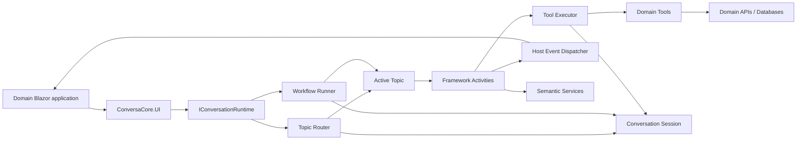
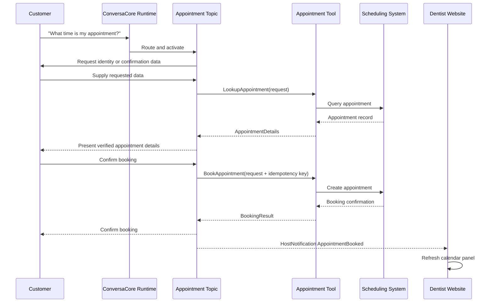

# ConversaCore Target Architecture

**Status:** Proposed target architecture  
**Date:** 2026-09-06  
**Scope:** `ConversaCore`, `ConversaCore.UI`, `ConversaCore.SDK`, and migration of `InsuranceAgent`  
**Companion plan:** [ConversaCore Transformation Work Breakdown](./ConversaCore.TransformationWorkBreakdown.md)

## 1. Executive decision

ConversaCore is a **bounded conversational workflow framework**. It uses AI inside explicitly authored workflows; it is not an always-on autonomous agent with unrestricted access to every capability.

The target architecture makes the following decisions:

1. The Domain Agent becomes a framework-owned, domain-neutral facade. A domain application must not subclass it or reproduce its orchestration and event wiring.
2. Domain developers author topics and register them in `Program.cs`. Topics remain the authority over conversation scope, sequencing, branching, and permitted capabilities.
3. ConversaCore owns topic discovery, activation, routing, execution, pause/resume, subtopic calls, cancellation, reset, and instrumentation.
4. ConversaCore.UI binds to one stable runtime contract and renders standard conversation output without domain-specific plumbing.
5. Host events remain the only domain-specific hook through which a website reacts to the conversation.
6. Tools become a second, non-UI extension point through which a conversation reads or changes domain data and receives a typed result.
7. Tools are not topics. Tool implementations are reusable operations; framework-owned activities invoke them from topics.
8. Semantic tool selection is permitted only within a topic-defined allowlist and only at an explicit selection point.

The intended domain-developer experience is:

```csharp
builder.Services
    .AddConversaCore(options =>
    {
        options.ChatModel = configuration["OpenAI:ChatModel"];
        options.EmbeddingModel = configuration["OpenAI:EmbeddingModel"];
    })
    .AddTopicsFromAssemblyContaining<AppointmentTopic>()
    .AddTool<LookupAppointmentTool>()
    .AddTool<SearchAvailabilityTool>()
    .AddTool<BookAppointmentTool>();
```

The application supplies topics, tools, domain services, and host-event reactions. It does not supply an agent subclass.

## 2. Product boundaries

| Product or application | Target responsibility |
|---|---|
| `ConversaCore` | Conversation runtime, topic and activity execution, routing, state, tool execution, semantic services, host-event dispatch, diagnostics |
| `ConversaCore.UI` | Reusable Blazor chat presentation, standard cards and prompts, output subscription, host-event adapter points |
| `ConversaCore.SDK` | Project template, authoring guidance, samples, validation, and developer tooling |
| Domain application such as `InsuranceAgent` | Topics, domain models, tools, host-event contracts and reactions, domain infrastructure adapters |
| `LiveAgentConsole` / `LiveAgentConsoleV2` | Separate human-agent application consuming qualified leads; not a ConversaCore implementation |

The existing product and execution diagrams document the current system and remain useful as an as-is baseline:

- [Current product architecture](./conversacore-current-product-architecture.html)
- [Current topic execution sequence](./conversacore-current-topic-execution-sequence.html)

Those diagrams should be regenerated as target-state diagrams after the public contracts in this document are implemented.

## 3. Goals and non-goals

### 3.1 Goals

- Make a domain implementation primarily a collection of registered topics.
- Keep conversation behavior bounded by authored topics.
- Give every conversation isolated mutable state.
- Make framework lifecycle behavior deterministic and awaitable.
- Separate presentation reactions from business operations.
- Make external operations typed, observable, testable, and policy-controlled.
- Preserve optional use of AI for routing, extraction, decisions, and response composition.
- Make the SDK template demonstrate the recommended architecture without V2/V3 alternatives.

### 3.2 Non-goals

- Building a general autonomous agent loop.
- Allowing an LLM to discover or invoke every registered service.
- Converting the live-agent applications into ConversaCore bots.
- Replacing Adaptive Cards or all existing topic authoring primitives in the first migration.
- Rewriting every insurance topic before the new runtime can coexist with the old API.
- Introducing a distributed workflow engine in the first release.

## 4. Architectural principles

### 4.1 Topics own conversational jurisdiction

A topic represents a bounded customer intent or business workflow. It may span multiple turns, request information, branch, call subtopics, invoke tools, and emit host events. A topic decides which capabilities are relevant; the model does not independently expand that scope.

### 4.2 The framework owns orchestration

Topic routing, active-topic state, subtopic stacks, activity event propagation, output delivery, cancellation, and reset are framework concerns. Domain code must not manually subscribe every activity, manipulate internal state machines through reflection, or repair asynchronous execution.

### 4.3 AI advises inside explicit boundaries

Semantic processing is an implementation option for a particular activity. It may classify, extract, rank, or compose, but it does not own the workflow. Deterministic code validates all model output before it can alter state or invoke a mutating capability.

### 4.4 Domain operations return data; host events request reactions

A tool retrieves or changes domain data and returns a typed result to the running topic. A host event tells the containing website to update, navigate, show domain-specific UI, or provide an interaction response. A topic can do both in sequence.

### 4.5 Mutable state never crosses conversation boundaries

Catalogs may be singleton only when immutable. Conversation state, workflow state, active topic instances, pending interactions, and user identity are scoped to one conversation session.

## 5. Target component model



### 5.1 Dependency rules

1. Domain applications reference `ConversaCore` and optionally `ConversaCore.UI`.
2. `ConversaCore` never references a domain application or `ConversaCore.UI`.
3. `ConversaCore.UI` depends only on stable public ConversaCore contracts, not domain services.
4. Topics depend on public framework abstractions and their own domain contracts.
5. Tools depend on domain services and the narrow tool execution contract, not UI components or topic internals.
6. Host-event handlers depend on public event contracts and host UI/application services, not mutable workflow internals.

## 6. Framework-owned Domain Agent facade

The current `DomainAgentService` combines public commands, routing, topic stack management, event relay, card state, reset behavior, and domain override points. The target replaces that inheritance model with a composition-based facade.

The proposed public surface is conceptually:

```csharp
public interface IConversationRuntime
{
    string ConversationId { get; }

    Task StartAsync(CancellationToken cancellationToken = default);
    Task SendMessageAsync(string message, CancellationToken cancellationToken = default);
    Task SubmitCardAsync(CardSubmission submission, CancellationToken cancellationToken = default);
    Task RespondToHostInteractionAsync(
        HostInteractionResponse response,
        CancellationToken cancellationToken = default);
    Task ResetAsync(CancellationToken cancellationToken = default);

    IConversationOutputSubscription Subscribe();
}
```

The exact names can change during API design, but these rules cannot:

- The implementation is supplied by ConversaCore.
- There is one scoped runtime per conversation or Blazor circuit.
- All commands are asynchronous and return completion to their caller.
- Output is delivered through an asynchronous, disposable subscription rather than `async void` event chains.
- Domain behavior enters through registered topics, tools, and host-event contracts—not overrides.

ConversaCore registers the facade with `AddConversationRuntime(startTopicId, routingOptions)`.
The registration is scoped and lazy: resolving the runtime validates the configured start
descriptor but does not activate a topic. `StartAsync` is idempotent within the scope and
`ResetAsync` cancels and disposes the current activation and its legacy output lease before
starting a fresh activation. Disposal attempts every retained activation and lease, and
then disposes host-interaction and output services so one cleanup failure cannot strand the
remaining conversation resources.

For migration, the existing `DomainAgentService` can temporarily wrap `IConversationRuntime`. It should be marked obsolete once the new UI adapter is functional and removed in the next breaking release.

## 7. Topic discovery, activation, and routing

### 7.1 Separate immutable definitions from mutable instances

The runtime needs two distinct concepts:

- `TopicDescriptor`: immutable identity, description, priority, routing metadata, tool allowlist, and factory metadata.
- Topic instance: mutable workflow execution belonging to one conversation and one activation lifecycle.

An immutable `ITopicCatalog` may be singleton. It must not store scoped topic instances. `ITopicActivator` resolves or creates topic instances from the active conversation scope.

### 7.2 One routing authority

`TopicRegistry` and `TopicManager` currently overlap. The target has one `ITopicRouter` backed by `ITopicCatalog`.

Routing policy should be:

1. If the active topic is waiting for user input, offer the input to that topic first.
2. Reroute only when the active topic declines the input or explicitly permits interruption.
3. Rank eligible topic descriptors using deterministic matching first.
4. Invoke semantic ranking only when configured and necessary.
5. Apply thresholds and policy in framework code.
6. Use a registered system fallback topic when no domain topic qualifies.

Topic eligibility checks must be side-effect free and fast. Registration validation must reject duplicate IDs and references to missing subtopics.

### 7.3 Lifecycle

- Construction performs no background work.
- Any asynchronous build or initialization is awaited before a topic becomes routable.
- Pause, resume, child completion, fallback interruption, and reset are operations of the workflow runner.
- The runner owns the topic call stack; topics do not coordinate it through mutually subscribed events.
- State transitions are public framework operations. Reset never uses reflection.
- Cancellation flows through every topic, activity, semantic call, host interaction, and tool call.

## 8. Conversation and workflow state

The target retains two logical state scopes while giving them explicit boundaries:

| Scope | Lifetime | Contains |
|---|---|---|
| Conversation session | Entire customer conversation | Conversation ID, authenticated subject, shared domain values, history references, active topic, call stack, pending host interactions |
| Topic execution | One topic activation | Activity cursor, topic-local values, validated models, child results, activity status |

Public activities receive a narrow context interface. UI and host-event consumers receive immutable payloads or snapshots, never the mutable `TopicWorkflowContext` itself.

String context keys remain available for compatibility, but new framework APIs should support typed keys or typed state accessors. Sensitive values should be classified so diagnostics and host events can redact them.

## 9. Conversation output and ConversaCore.UI

### 9.1 Standard output

The runtime publishes a typed output hierarchy such as:

```text
ConversationOutput
├── MessageOutput
├── AdaptiveCardOutput
├── CardStateOutput
├── PromptStateOutput
├── TopicLifecycleOutput
├── ActivityLifecycleOutput
└── HostOutput
    ├── HostNotificationOutput
    └── HostInteractionRequestOutput
```

ConversaCore.UI automatically handles standard messages, cards, prompt state, and lifecycle state. The domain application does not manually forward these events.

The dispatcher must preserve order per conversation, isolate subscriber failures, support cancellation and disposal, and avoid unobserved fire-and-forget work.

### 9.2 Host events: the website hook

Host events remain the only domain-specific hook exposed to the containing website. There are two explicit forms:

1. `HostNotification<TPayload>` is one-way. The topic continues after dispatch.
2. `HostInteractionRequest<TRequest,TResponse>` pauses at an awaitable boundary until the host responds, cancellation occurs, or a timeout expires.

Every host interaction carries a correlation ID. The response completes exactly one pending request. Late and duplicate responses are rejected predictably.

Host events must be typed and versionable. A legacy string-name adapter may exist during migration, but new topics should not exchange anonymous objects or expose workflow context.

Use host events for:

- Updating a progress panel or customer console
- Navigating or focusing domain-specific site content
- Opening genuinely host-specific UI
- Informing the host that a domain change has completed
- Requesting an interaction that standard chat controls cannot represent

Do not use host events as a general mechanism for database writes or external API calls merely because the current host can perform them. Those operations are tools.

## 10. Domain tools

### 10.1 Tool contract

A tool is one reusable, typed domain operation. It does not own conversation flow, render UI, select another topic, or directly mutate workflow state.

```csharp
public interface IConversaTool<TRequest, TResult>
{
    ToolDescriptor Descriptor { get; }

    ValueTask<ToolResult<TResult>> ExecuteAsync(
        TRequest request,
        ToolExecutionContext context,
        CancellationToken cancellationToken);
}
```

CC-400 defines these typed contracts in `ConversaCore.Tools`. `ToolDescriptor` is immutable
registration metadata, `ToolExecutionContext` carries only trusted conversation identity,
correlation, and scoped domain-service access, and `ToolResult<TResult>` represents an
explicit typed success or safe failure. CC-401 adds immutable declarative side-effect,
authorization, confirmation, reliability, sensitivity, and audit metadata; enforcement
remains in CC-403.

`ToolDescriptor` should contain:

- Stable tool ID and version
- Human and semantic descriptions
- Request and result type/schema metadata
- Read-only or mutating side-effect classification
- Required authorization policy or claims
- Whether explicit user confirmation is required
- Timeout, retry, and idempotency policy
- Data-sensitivity and audit metadata

`ToolExecutionContext` exposes only required execution information such as conversation ID, authenticated subject, correlation ID, service scope, and tracing context. It does not expose UI components or an unrestricted mutable workflow context.

### 10.2 Tool invocation is an activity

The tool implementation itself does not inherit `TopicFlowActivity`. ConversaCore supplies framework activities such as:

```csharp
InvokeToolActivity<TTool, TRequest, TResult>
SelectAndInvokeToolActivity<TResult>
```

The first is deterministic and preferred when the workflow knows which capability is required. The second performs constrained semantic selection when a topic intentionally allows several alternatives.

This preserves a concise topic-authoring API while keeping the capability reusable across topics.

### 10.3 Bounded discovery

Semantic tool discovery follows these rules:

1. Topic routing occurs before tool selection.
2. A topic explicitly declares its allowed tools or tool set.
3. Selection runs only at an explicit tool-choice activity.
4. The framework prefilters candidates using cached descriptors, deterministic eligibility, and optionally embeddings.
5. Only a small top-K candidate list is supplied to the model.
6. Model output selects a candidate; it never grants authorization or bypasses validation.
7. Mutating tools require policy checks and, where declared, explicit user confirmation.

Tool descriptors, schemas, and embeddings are built or cached at startup. ConversaCore must not scan and semantically compare a global catalog on every message.

CC-402 provides the singleton immutable `IToolCatalog` over descriptor metadata. Explicit
descriptor registration does not activate tool instances; executor resolution remains a
per-invocation concern owned by CC-403.

### 10.4 Results and conversation responses

Tools return domain DTOs and structured errors, not final conversational prose. The topic or a response activity decides how to present the result. A returned tool result is available to the current conversation; it does not train the model or become permanent memory unless an explicit persistence feature stores it.

The framework emits `ToolInvoking`, `ToolCompleted`, and `ToolFailed` diagnostics. Sensitive request and result fields are redacted by descriptor policy.

### 10.5 Relationship to existing integrations

`IIntegrationService` is useful lower-level transport and provider plumbing. It is not the domain tool contract. Provider-specific activities such as `ZapierWebhookActivity` currently combine integration execution with workflow/context behavior. The target separates them:

```text
InvokeToolActivity
    -> ZapierWebhookTool
        -> IIntegrationService
            -> configured HTTP/provider transport
```

Local tools may call repositories directly; not every tool is external, so `ExternalToolActivity` is too narrow a name for the primary abstraction.

## 11. Dentist reference flow

The dentist scenario demonstrates all four concepts without turning the runtime into an autonomous agent.



`LookupAppointmentTool`, `SearchAvailabilityTool`, and `BookAppointmentTool` are reusable across appointment-related topics. The topic still decides what information to collect, what order to follow, and when confirmation is sufficient.

## 12. InsuranceAgent migration classification

The current `InsuranceAgent/Pages/Home.razor` custom-event switch demonstrates valid host reactions and business operations that currently reside in the presentation layer. They should be classified as follows:

| Current behavior | Target mechanism | Reason |
|---|---|---|
| Update qualification progress | Host notification | Pure visual reaction |
| Update `CustomerConsole` | Host notification | Domain-specific presentation |
| Navigate or reveal a page panel | Host notification | Host presentation concern |
| Show a generic confirmation/question | Standard prompt/card when possible | Reusable chat behavior belongs in ConversaCore.UI |
| Show irreducibly site-specific dialog | Host interaction request | Host must render and return a correlated response |
| Create a lead and obtain its ID | Domain tool | Business write whose result is required by later workflow steps |
| Save contact, goals, health, dependents, employment, or beneficiaries | Domain tools | Business persistence must not depend on a Blazor page subscriber |
| Trigger Zapier and consume a result | Domain tool over integration transport | External operation returns data to the workflow |
| Notify a live-agent system after qualification | Tool for queue/persistence; optional host notification for UI | Business side effect and visual reaction are separate |

The insurance start/compliance sequence currently inserted by `InsuranceAgentServiceV2` should become an ordinary registered topic or composition of topics. No start-flow mutation belongs in a domain agent subclass.

## 13. Dependency injection and lifetimes

| Service | Recommended lifetime | Rationale |
|---|---|---|
| `ITopicCatalog` | Singleton | Immutable descriptors and factories only |
| `IToolCatalog` | Singleton | Immutable descriptors and schemas only |
| Model/embedding clients | Singleton where provider client supports it | Connection reuse; no conversation state |
| `IConversationRuntime` | Scoped | One Blazor circuit or conversation |
| Conversation session/context | Scoped | Mutable per-conversation state |
| Workflow runner/router | Scoped | Uses the active session |
| Topic instances | Transient activation within the conversation scope | Mutable execution cannot be shared |
| Tool executor | Scoped | Uses session identity, authorization, and scoped domain services |
| Tool implementation | Scoped or transient | Determined by dependencies; resolved per invocation |
| UI output subscription | Component/circuit lifetime | Must be disposed with the component |

Startup may validate and compile descriptors. It must not create a temporary scope and retain its scoped topic instances in a singleton registry.

`ConversaCore.UI` owns exactly one output subscription for each chat component/circuit. Component initialization is idempotent; disposal cancels the output pump, releases the subscription, and detaches every temporary compatibility event handler. A failing host callback is logged and isolated from later output delivery.

## 14. Reliability, security, and observability

### 14.1 Reliability

- No `async void` handlers except unavoidable UI framework entry points, where exceptions are immediately captured.
- No untracked `Task.Run` for workflow, initialization, integrations, or event delivery.
- Host interactions and tool calls have framework-enforced timeouts and cancellation.
- Mutating tools support idempotency so retries cannot duplicate appointments or leads.
- Subscriber or telemetry failure cannot corrupt workflow state.

### 14.2 Security

- The tool catalog is not a service locator.
- Topic allowlists restrict tool visibility.
- Authorization is checked by framework policy immediately before invocation.
- Customer identity comes from trusted session/authentication context, not model-produced arguments.
- Tool arguments are typed and validated.
- Mutations requiring confirmation cannot execute before a recorded confirmation boundary.
- Host payloads contain the minimum required data and never expose mutable context.

### 14.3 Observability

All runtime operations share a conversation ID and correlation/trace ID. Structured diagnostics cover:

- Input accepted and output produced
- Topic candidates, scores, selection, activation, pause, resume, completion, and failure
- Activity start, completion, wait, and failure
- Host notification and interaction request/response lifecycle
- Tool selection, policy decision, invocation, latency, result classification, and failure
- Semantic model, token usage, latency, and validated output status

Business-sensitive payload values are excluded by default.

## 15. Current-to-target mapping

| Current element | Target disposition |
|---|---|
| Abstract `DomainAgentService` | Temporary compatibility adapter, then replace with framework-owned `IConversationRuntime` implementation |
| `InsuranceAgentServiceV2` | Eliminate after moving start/compliance composition into topics |
| Legacy `InsuranceAgentService` | Remove after behavior is covered and migration completes |
| `TopicRegistry` storing topic instances | Replace with immutable `ITopicCatalog` plus scoped activation |
| `TopicManager` | Merge routing behavior into one `ITopicRouter` |
| Manual `ConfigureTopics` startup scope | Replace with registration descriptors and startup validation |
| Activity-by-activity event hooking | Replace with workflow-runner output dispatch |
| `EventTriggerActivity` | Compatibility adapter over typed host notification/interaction activities |
| String event names and `object` payloads | Replace with typed, versionable host contracts |
| UI access to `TopicWorkflowContext` | Replace with immutable event payloads or snapshots |
| `ZapierWebhookActivity` | Split into tool implementation and framework invocation activity |
| Constructor `Task.Run` topic initialization | Replace with awaited activation/build lifecycle |
| Reflection-based topic reset | Replace with public workflow-runner reset |

## 16. Compatibility strategy

The migration should be incremental rather than a big-bang rewrite:

1. Add the new contracts and runtime alongside the current service.
2. Build a compatibility adapter that translates existing activity events into the new output stream.
3. Move ConversaCore.UI to the new facade while old topics continue to run.
4. Introduce typed host events and tools, retaining legacy adapters temporarily.
5. Migrate InsuranceAgent and the SDK template.
6. Mark old APIs obsolete with actionable compiler messages.
7. Remove obsolete implementations only after integration and concurrency gates pass.

Compatibility code must be visibly isolated under a `Compatibility` namespace/folder and must not become a permanent second runtime.

## 17. Target acceptance criteria

The target architecture is achieved when all of the following are true:

- A new domain application can run by registering ConversaCore, topics, optional tools, and optional host handlers in `Program.cs`.
- No domain-specific agent service or orchestration subclass exists in the SDK template or InsuranceAgent.
- Two simultaneous Blazor circuits do not share topic, card, stack, interaction, or context state.
- Conversation start, message input, card submission, fallback interruption, subtopic return, reset, and cancellation are deterministic and covered by tests.
- Standard chat behavior requires no domain event forwarding.
- Typed one-way host notifications and correlated host interactions both work end to end.
- Read-only and mutating tools execute through validation, authorization, telemetry, timeout, and cancellation policies.
- Semantic tool selection sees only the active topic's allowlist and is not invoked on ordinary messages unless the topic requests it.
- Insurance lead persistence no longer depends on `Home.razor` being subscribed.
- The SDK template and authoring guide demonstrate exactly one recommended architecture.

## 18. Decision summary

| Decision | Outcome |
|---|---|
| Domain Agent inheritance | Rejected; use a framework-owned facade |
| Topic instances in a singleton registry | Rejected; singleton metadata plus conversation-scoped activation |
| Custom events for all external work | Rejected; host events for host reactions, tools for domain operations |
| Tools as topic subclasses | Rejected |
| Tools as activity subclasses | Rejected for implementations; framework invocation is an activity |
| Global tool discovery on every message | Rejected |
| Topic-scoped semantic tool selection | Accepted as an optional explicit activity |
| UI access to mutable workflow context | Rejected |
| Literal asynchronous .NET event chains as the primary transport | Rejected; use awaitable output dispatch/subscriptions |

Implementation sequencing, work packages, estimates, gates, and deliverables are defined in the companion [work breakdown plan](./ConversaCore.TransformationWorkBreakdown.md).
