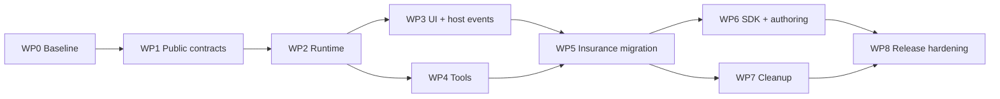

# ConversaCore Transformation Work Breakdown

**Status:** Proposed delivery plan  
**Date:** 2026-09-06  
**Architecture baseline:** [ConversaCore Target Architecture](./ConversaCore.TargetArchitecture.md)

**Execution tracker:** [GitHub master issue #12](https://github.com/lg061870/InsuranceSemanticV2/issues/12). Each WP is a phase parent and every CC task has its own sub-issue. Record changes, reasons, verification evidence, and remaining work on the task issue. Close only after its full scope and definition of done are satisfied and delivered in GitHub.

## 1. Purpose

This plan transforms the current ConversaCore implementation into the target architecture without requiring a big-bang rewrite. It covers the framework runtime, ConversaCore.UI, domain tools, host events, InsuranceAgent migration, the SDK template, cleanup, and release hardening.

The plan is organized as work packages that can be converted directly into epics and tickets. Each package has an outcome, task breakdown, dependencies, acceptance criteria, and a rough engineering estimate.

## 2. Planning assumptions

- Estimates are **ideal engineer-days**, including implementation, code review, and automated tests.
- Estimates are planning ranges, not commitments. Re-estimate after the characterization work in WP0.
- One engineer working sequentially should expect approximately **66–102 ideal days** for the complete transformation.
- Two engineers can parallelize UI, tools, migration, and SDK work after the runtime contracts stabilize; dependencies prevent a simple 50% calendar reduction.
- Existing behavior should remain available through compatibility adapters until InsuranceAgent and the SDK template have migrated.
- Removal of old V2/V3 code is deferred until replacement behavior passes the release gates.
- The current dirty worktree and generated diagram artifacts are outside this plan's cleanup scope unless explicitly classified during WP0.

## 3. Delivery outcomes

| Milestone | Outcome | Included work packages |
|---|---|---|
| M0 — Baseline locked | Existing behavior and migration decisions are testable and documented | WP0 |
| M1 — Framework runtime | Domain-neutral facade, correct lifetimes, single router, deterministic workflow lifecycle | WP1–WP2 |
| M2 — UI and host boundary | ConversaCore.UI uses the facade; typed notification and request/response host events work | WP3 |
| M3 — Tool capability | Typed tools, policies, deterministic invocation, and bounded semantic selection work | WP4 |
| M4 — Reference migration | InsuranceAgent runs without a domain agent subclass and persists through tools | WP5 |
| M5 — Developer product | SDK template and authoring material show one supported path | WP6–WP7 |
| M6 — Release ready | Concurrency, resilience, security, compatibility, and packaging gates pass | WP8 |

## 4. Workstream map

The critical path is WP0 → WP1 → WP2 → WP3/WP4 → WP5 → WP6/WP7 → WP8. WP3 and WP4 can proceed in parallel once the session, context, and output contracts from WP2 are stable.

## 5. WP0 — Baseline, decisions, and safety net

Current working inventory: [ConversaCore.WP0CurrentStateInventory.md](ConversaCore.WP0CurrentStateInventory.md). It establishes the initial evidence for CC-000, CC-001, CC-002, and CC-005; those items remain open until their findings and the CC-003/CC-004 characterization results are approved.

**Outcome:** The team can change orchestration safely because current behavior, intended behavior, and obsolete experiments are distinguishable.  
**Estimate:** 4–6 days  
**Dependencies:** None

### Tasks

- [x] **CC-000 — Inventory public and semi-public APIs.** The framework/domain/UI ownership inventory is recorded in [WP0 current state inventory](ConversaCore.WP0CurrentStateInventory.md); exhaustive migration-specific consumer cleanup remains WP5/WP7 scope.
- [x] **CC-001 — Build a topic-registration inventory.** The registration, runtime-name, fallback/start, and missing-target findings are recorded in the WP0 inventory; fixing InsuranceAgent registrations remains WP5 scope.
- [x] **CC-002 — Build a host-event inventory.** The producer/consumer/classification matrix is recorded in the WP0 inventory; exact InsuranceAgent payload replacement remains WP5 typed-contract scope.
- [x] **CC-003 — Add characterization tests.** Framework-level start, active input, fallback, cards, subtopics, reset, semantic completion, and host-event characterization are covered; InsuranceAgent-specific exhaustive characterization is intentionally deferred to WP5.
- [x] **CC-004 — Add a two-session isolation test.** Four legacy characterization tests demonstrate scoped isolation versus singleton registry leakage and cross-session reset. The 17-test characterization suite and solution build pass; delivery and completion evidence are tracked in [#18](https://github.com/lg061870/InsuranceSemanticV2/issues/18). Positive isolation tests remain a separate required gate in [CC-212 #42](https://github.com/lg061870/InsuranceSemanticV2/issues/42); see `ConversaCore.Tests/Characterization/LegacySessionIsolationTests.cs`.
- [x] **CC-005 — Record cleanup candidates.** V2/V3 services, duplicate orchestration, demos, logging, and obsolete guides are classified in the WP0 inventory; deletion remains gated by WP5–WP8.
- [x] **CC-006 — Approve target ADRs.** ADR-001 through ADR-006 record the approved facade, activation, output, host-event, tool, and bounded-selection boundaries implemented by WP1–WP4.

### Acceptance criteria

- A test or documented scenario exists for every behavior that InsuranceAgent relies on.
- Every emitted custom event has a target classification.
- Every topic referenced by name is either registered, deliberately removed, or tracked as a defect.
- The target public-contract decisions have no unresolved architectural blockers.
- No cleanup deletion occurs in this package.

## 6. WP1 — Public registration and metadata contracts

**Outcome:** Domain applications can declare topics and future tools without manually constructing them or populating a runtime registry.  
**Estimate:** 5–8 days  
**Dependencies:** WP0 decision approval

### Tasks

- [x] **CC-100 — Introduce `ConversaCoreBuilder`.** Change or overload `AddConversaCore` to return a fluent builder while preserving the current extension during migration. Delivered as a differently-named `AddConversaCoreBuilder` sibling entry point (a true overload differing only by return type is illegal in C#, CS0111); see [#22](https://github.com/lg061870/InsuranceSemanticV2/issues/22).
- [x] **CC-101 — Define `TopicDescriptor`.** Include stable ID, display name, description, priority, routing metadata, system/domain classification, interruption policy, and allowed tool IDs. See [#23](https://github.com/lg061870/InsuranceSemanticV2/issues/23).
- [x] **CC-102 — Define registration APIs.** Support `AddTopic<T>()`, explicit factories where needed, and `AddTopicsFromAssemblyContaining<T>()`. See [#24](https://github.com/lg061870/InsuranceSemanticV2/issues/24).
- [x] **CC-103 — Add startup validation.** Aggregated duplicate-ID and missing start/fallback validation is implemented. Duplicate aliases, invalid lifetimes, and unresolved subtopic references are explicitly deferred because the current descriptor model has no alias, activation-lifetime, or subtopic-reference concepts; those checks must be added only with a future contract decision rather than invented during this migration. See [#25](https://github.com/lg061870/InsuranceSemanticV2/issues/25).
- [x] **CC-104 — Separate definitions from instances.** Ensure registration builds immutable descriptors and factories without resolving scoped topic objects. The guarantee already held by construction from CC-100–103; delivered as holistic acceptance-test evidence, no production code change needed. See [#26](https://github.com/lg061870/InsuranceSemanticV2/issues/26).
- [x] **CC-105 — Provide compatibility registration.** Translate existing `IEnumerable<ITopic>` registrations into descriptors during the migration window. See [#27](https://github.com/lg061870/InsuranceSemanticV2/issues/27).
- [x] **CC-106 — Add API and validation tests.** Cover scanning, explicit registration, duplicate handling, deterministic ordering, and useful diagnostics. Closed a genuine gap in deterministic-ordering test coverage; the other four areas were already adequately covered. See [#28](https://github.com/lg061870/InsuranceSemanticV2/issues/28).

### Acceptance criteria

- A domain app can register a topic without a manual factory when constructor injection is sufficient.
- Startup validation lists all registration errors in one actionable report.
- No singleton service retains a topic or context resolved from a temporary scope.
- Existing topic registrations can run through an isolated compatibility path.

## 7. WP2 — Conversation runtime and workflow lifecycle

**Outcome:** ConversaCore owns a scoped, deterministic runtime; domain agent subclasses are no longer required for orchestration.  
**Estimate:** 12–18 days  
**Dependencies:** WP1

### Tasks

- [x] **CC-200 — Define `IConversationRuntime`.** Add awaitable start, message, card-submit, host-response, reset, and output-subscription operations. Contract only (no implementation); ships with minimal WP3-scoped placeholder types (`CardSubmission`, `HostInteractionResponse`, `IConversationOutputSubscription`) documented as stopgaps. See [#30](https://github.com/lg061870/InsuranceSemanticV2/issues/30).
- [x] **CC-201 — Implement the conversation session.** Own conversation identity, authenticated subject, active topic, topic stack, pending interactions, and shared state in a scoped service. Composes the existing `IConversationContext` rather than reimplementing it; adds a typed `ActiveTopic` and a pending-host-interaction registry. See [#31](https://github.com/lg061870/InsuranceSemanticV2/issues/31).
- [x] **CC-202 — Implement immutable `ITopicCatalog`.** Store descriptors and activation metadata only. See [#32](https://github.com/lg061870/InsuranceSemanticV2/issues/32).
- [x] **CC-203 — Implement `ITopicActivator`.** Resolve a fresh mutable topic execution from the current conversation scope and await initialization before exposing it. Defines a new optional `IAsyncInitializable` seam for the awaited-initialization phase; no real topic migrated onto it yet (that's CC-209/WP5). See [#33](https://github.com/lg061870/InsuranceSemanticV2/issues/33).
- [x] **CC-204 — Consolidate routing into `ITopicRouter`.** Catalog-only selection, explicit first-refusal decisions, deterministic trigger phrases, optional bounded semantic ranking, and explicit system fallback are implemented and covered by the consolidated WP2 framework test run. See [routing contract and integration boundaries](ConversaCore.TopicRouting.md). No InsuranceAgent migration is included.
- [x] **CC-205 — Implement `IWorkflowRunner`.** The scoped runner owns activation retention, serialized command execution, immutable outcome dispatch, and terminal/wait transitions. Lifecycle and registration coverage is documented in [workflow-runner boundaries](ConversaCore.WorkflowRunner.md); the public runtime facade remains separately tracked.
- [x] **CC-206 — Move subtopic coordination into the runner.** Runner-owned parent retention, catalog-validated child activation, session-stack ownership, nested execution, and exactly-once parent resumption are implemented and lifecycle-tested. See [subtopic coordination](ConversaCore.SubtopicCoordination.md).
- [x] **CC-207 — Implement interruption and fallback policy.** `IConversationMessageCoordinator` composes router and runner for first refusal, declined-input rerouting, declared interruption, explicit fallback, and deterministic saved-instance resumption. See [interruption policy](ConversaCore.InterruptionPolicy.md).
- [x] **CC-208 — Implement reset and cancellation.** Runner-owned linked cancellation propagates through active operations; cancel/reset drain serialized execution and clear retained/session state without reflection. See [reset and cancellation](ConversaCore.ResetAndCancellation.md).
- [x] **CC-209 — Eliminate constructor background initialization.** `IAsyncInitializable` and `TopicActivator` provide and test the awaited topic build/activation phase; ConversaCore contains no topic constructor with untracked initialization. Migration of the known InsuranceAgent `MarketingT1Topic` constructor is deliberately deferred to the [WP5 migration matrix](https://github.com/lg061870/InsuranceSemanticV2/issues/70), after the framework is done.
- [x] **CC-210 — Replace internal `async void` paths.** Semantic and integration operations are awaited, Repeat/Composite continuations are tracked with owner-level failure handling, legacy event shims observe task-returning callbacks centrally, and executable scans contain no `async void`, discarded async calls, or untracked `Task.Run`. The formerly-background semantic path is covered end to end as an awaited regression.
- [x] **CC-211 — Add lifecycle tests.** Start, run, wait, resume, nested subtopics, fallback interruption, cancellation, reset, propagated failure, and repeated fresh activation are covered by `WorkflowRunnerLifecycleTests`.
- [x] **CC-212 — Add concurrency tests.** `WorkflowRunnerConcurrencyTests` execute independent conversations concurrently and verify active topic, shared state, call stack, output, cancellation/reset, serialization, and activation-instance isolation.

### Acceptance criteria

- A framework-provided runtime can execute existing topics through the compatibility adapter.
- No app-defined subclass is needed for routing, output propagation, subtopic handling, or reset.
- Topic instances and mutable contexts are never shared between conversation scopes.
- Subtopic completion resumes exactly one parent at the correct activity.
- Topic activation cannot race its initialization.
- All lifecycle and concurrency tests pass repeatedly.

## 8. WP3 — Typed output, host events, and ConversaCore.UI

**Outcome:** ConversaCore.UI binds to the runtime directly, while domain websites receive one typed host-event hook.  
**Estimate:** 8–12 days  
**Dependencies:** WP2 output/session contracts

### Tasks

- [x] **CC-300 — Define the `ConversationOutput` hierarchy.** Immutable, context-free contracts now cover messages, cards, card state, prompt state, topic/activity lifecycle, plus abstract versioned host-notification and correlated host-interaction categories for CC-303/304 specialization. `IConversationOutputSubscription` now streams the typed base contract; see [typed conversation output](ConversaCore.ConversationOutput.md).
- [x] **CC-301 — Implement ordered asynchronous dispatch.** The scoped dispatcher serializes publication and fans immutable outputs out to independent asynchronous subscriptions, preserving a common per-conversation order without invoking consumer code. Tests cover concurrent publication, multiple subscribers, cancellation, disposal, consumer-failure isolation, conversation validation, and DI scope; see [typed conversation output](ConversaCore.ConversationOutput.md).
- [x] **CC-302 — Adapt existing framework activities.** A scoped compatibility adapter translates existing `TopicFlow` topic/activity lifecycle, message, card, card-state, and prompt-state events into typed immutable outputs through a lease-owned ordered pump. The lease owns all legacy handlers and exposes no workflow context; runtime attachment is reserved for CC-306. See [typed conversation output](ConversaCore.ConversationOutput.md).
- [x] **CC-303 — Define typed host notifications.** `HostNotification<TPayload>` combines stable event identity/version with a frozen JSON payload snapshot and fresh typed reads, preventing mutation by producers or consumers. It dispatches as a normal non-blocking `ConversationOutput`; see [typed conversation output](ConversaCore.ConversationOutput.md).
- [x] **CC-304 — Define correlated host interactions.** Typed frozen requests carry unique IDs, declared response types, versions, and timeouts. The scoped coordinator awaits exactly one validated response and atomically rejects wrong-type, unknown, duplicate, expired, or late replies; timeout, cancellation, dispatch failure, and disposal clean pending session state. See [typed conversation output](ConversaCore.ConversationOutput.md).
- [x] **CC-305 — Implement compatibility for `EventTriggerActivity`.** Legacy one-way events now publish immutable notifications without awaiting host code; response-bearing events use the scoped correlation coordinator, retain configured names/timeouts/context keys, and clean pending state on success, cancellation, or timeout. The framework adapter owns and detaches the bridge and logs each obsolete use; see [typed conversation output](ConversaCore.ConversationOutput.md).
- [x] **CC-306 — Bind ConversaCore.UI to `IConversationRuntime`.** `CustomChatWindowV3` now resolves or accepts the stable runtime contract, consumes its typed output subscription, projects standard messages/cards/card state/prompt state, and sends start/message/card/reset commands directly. The old agent/event parameters are optional, editor-hidden migration fallbacks so the frozen reference application remains buildable; concrete framework facade assembly is tracked separately by CC-311.
- [x] **CC-307 — Add the host hook to the UI boundary.** A common `HostOutput` base now identifies the two domain-specific output forms. `CustomChatWindowV3.OnHostOutput` is the containing site's single typed hook, and its `ConversationHostOutputContext` forwards exactly correlated typed interaction responses through `IConversationRuntime` while rejecting responses to notifications.
- [x] **CC-308 — Fix component lifecycle and disposal.** `CustomChatWindowV3` now creates one guarded runtime subscription owner per component/circuit, isolates individual output-handler failures, and cancels and disposes the stream idempotently. Its temporary legacy fallback tracks all nine agent handlers in a detachable scope, and disposal also clears the component's inbound compatibility events so neither side retains the component.
- [x] **CC-309 — Add UI contract tests.** The integration contract suite connects the real dispatcher, UI subscription owner, presentation projection, host-output context, and interaction coordinator. It covers ordered message/card replacement, prompt disable/enable, presentation plus runtime reset, non-blocking notification publication, correlated response, timeout cleanup, disconnect disposal, and fresh reconnection subscription behavior without a domain-service event forwarder.
- [x] **CC-310 — Migrate `EventTriggerDemoTopic`.** The historical topic is absent from this checkout, so the framework test suite now contains an explicit framework-owned equivalent proving non-blocking notification and correlated interaction through `IConversationRuntime`; InsuranceAgent migration remains deferred.
- [x] **CC-311 — Assemble and register the concrete `IConversationRuntime` facade.** `AddConversationRuntime(startTopicId, routingOptions)` registers one lazy, scoped framework-owned facade that composes routing, session, workflow execution, typed output, legacy output leases, card submission, host responses, reset/restart, and disposal. Reset cancels the superseded command and starts a fresh activation; cleanup attempts every retained activation/lease before reporting failures. See [#113](https://github.com/lg061870/InsuranceSemanticV2/issues/113).

### Acceptance criteria

- Standard chat output renders without a domain service forwarding events.
- One-way host notifications cannot block topic execution.
- A host interaction resumes the exact pending activity with a validated response.
- Timeouts and component disposal leave no hanging tasks or event subscriptions.
- UI consumers receive immutable payloads, not `TopicWorkflowContext`.

## 9. WP4 — Typed tools and bounded semantic selection

**Outcome:** Topics can safely retrieve or change domain data and continue with typed results.  
**Estimate:** 10–15 days  
**Dependencies:** WP1 descriptors and WP2 runtime/context contracts; can run parallel with most of WP3

### Tasks

- [x] **CC-400 — Define tool contracts.** Added the immutable typed contracts in `ConversaCore.Tools`: `IConversaTool<TRequest,TResult>`, `ToolDescriptor`, `ToolExecutionContext`, and `ToolResult<TResult>`. Policy/side-effect metadata and execution enforcement remain CC-401 through CC-403.
- [x] **CC-401 — Define side-effect and policy metadata.** `ToolDescriptor` now carries immutable read/mutate, authorization, confirmation, timeout/retry/idempotency, sensitivity, and audit metadata with validation; enforcement remains CC-403.
- [ ] **CC-402 — Implement `IToolCatalog`.** Partial progress: singleton immutable descriptor lookup and explicit `AddTool` registration are implemented without tool activation. Assembly scanning and schema compilation remain before completion.
- [x] **CC-403 — Implement `IToolExecutor`.** Added scoped per-invocation resolution, DataAnnotations validation, authorization/confirmation/idempotency enforcement, timeout/cancellation handling, safe error classification, and structured redacted logging.
- [x] **CC-404 — Implement deterministic `InvokeToolActivity`.** Added the generic activity that maps workflow state to a typed request, invokes exactly one declared tool through `IToolExecutor`, and stores the typed `ToolResult` without exposing catalog or executor internals.
- [x] **CC-405 — Add topic tool allowlists.** `ToolExecutionContext` carries the framework-supplied topic allowlist and `ToolExecutor` rejects undeclared IDs before resolution or execution.
- [x] **CC-406 — Implement optional bounded selection.** Added explicitly enabled `IToolSelector`/`ToolSelector` ranking only the topic-supplied allowlist, with score validation, thresholding, deterministic tie-breaking, and cancellation propagation.
- [x] **CC-407 — Add selection prefilter and caching.** `ToolSelector` caches allowlist candidate snapshots, applies descriptor text prefiltering, caps semantic input at configurable top-K, and reuses ToolCatalog descriptor/type metadata caches.
- [x] **CC-408 — Add mutation safety.** Mutating execution now requires framework-validated identity, declared confirmation when required, and configured idempotency keys before implementation resolution/execution.
- [x] **CC-409 — Add tool observability.** Added injectable payload-free diagnostics for invocation, completion, latency, policy rejection, and failure; descriptor sensitivity is retained and observer failures are isolated.
- [x] **CC-410 — Refactor the Zapier seam.** Added typed `ZapierWebhookTool` over `IIntegrationService`, covered typed transport results, and marked direct `ZapierWebhookActivity` compatibility usage obsolete with an actionable migration message.
- [x] **CC-411 — Add tool tests.** Consolidated framework coverage for success, validation, authorization, cancellation, timeout, retry, idempotency, redaction, allowlist rejection, and semantic-selection confinement.
- [x] **CC-412 — Add a dentist reference test.** Added lookup and confirmed/idempotent booking fakes proving typed results return to workflow state and a booking emits only an optional immutable host notification payload.

### Acceptance criteria

- Tool implementations contain no UI or topic lifecycle code.
- Tool results return to the topic as typed data.
- A topic cannot invoke an undeclared tool.
- A model cannot authorize a tool or bypass request validation and confirmation.
- Global tool discovery is absent from the ordinary message path.
- Read and write tool behavior is covered by policy and failure tests.

## 10. WP5 — InsuranceAgent reference migration

**Outcome:** InsuranceAgent demonstrates the target developer model and no longer depends on domain-authored orchestration.  
**Estimate:** 12–18 days  
**Dependencies:** WP3 and WP4

### Tasks

- [x] **CC-500 — Freeze an InsuranceAgent migration matrix.** Added [InsuranceAgent → ConversaCore migration matrix](InsuranceAgent.ConversaCoreMigrationMatrix.md) covering current registrations, start-flow mutation, host events, persistence, integrations, topic identity, target mechanisms, and the gated migration order.
- [ ] **CC-501 — Move startup/compliance composition into topics.** Added the registered `InsuranceConversationStartTopic` composition as the first extraction; final service/page cutover and removal of the legacy mutation remain in CC-502.
- [ ] **CC-502 — Replace the domain agent injection.** Inject the framework runtime into the page/UI component and remove `SubscribeToChatWindowEvents` usage.
- [ ] **CC-503 — Define typed insurance host contracts.** Convert progress, customer-console, navigation, and qualification-complete notifications to immutable payloads.
- [ ] **CC-504 — Move lead creation into a tool.** `CreateLeadTool` now returns the created ID into conversation state and `Home.razor` no longer owns `currentLeadId`; end-to-end and failure-path evidence remains under CC-512.
- [ ] **CC-505 — Move profile persistence into tools.** Contact, life goals, coverage intent, health, dependents, employment, and beneficiary writes now execute as topic-owned tools; focused tool and insurance end-to-end coverage remains before closure.
- [ ] **CC-506 — Migrate dialogs and questions.** Use standard cards/prompts where sufficient; use correlated host interactions only for genuinely site-specific UI.
- [ ] **CC-507 — Preserve visual reactions.** Keep qualification progress and `CustomerConsole` updates as host notifications handled by the site.
- [ ] **CC-508 — Migrate Zapier usage.** Invoke the new Zapier tool when a response or durable execution is part of the workflow; use a host notification only for visual feedback.
- [ ] **CC-509 — Repair topic identity and registration.** Resolve missing T2/T3 registrations, inconsistent runtime names such as `MarketingTypeTwoTopic`, and references to nonexistent topics.
- [ ] **CC-510 — Remove agent-owned async follow-up repairs.** Move semantic follow-up insertion/execution into the framework runner.
- [ ] **CC-511 — Verify the live-agent boundary.** Keep human-agent operation separate; define only the qualified-lead handoff contract needed by InsuranceAgent.
- [ ] **CC-512 — Add end-to-end tests.** Cover consent branches, full and partial qualification, all persistence steps, fallback interruption, customer-console updates, completion, and live-agent handoff.
- [ ] **CC-513 — Run two-circuit reference validation.** Execute independent insurance conversations simultaneously with different lead data and assert isolation.

### Acceptance criteria

- `InsuranceAgentServiceV2` is no longer used by application code.
- Conversation start and compliance behavior are expressed entirely through registered topics.
- `Home.razor` performs no lead/profile persistence in response to chat events.
- All domain-specific page reactions use typed host events.
- A completed lead exists even if no optional dashboard subscriber is mounted.
- All insurance end-to-end and isolation tests pass.

## 11. WP6 — SDK template and authoring experience

**Outcome:** A developer starting from ConversaCoreSDK sees one small, correct implementation model.  
**Estimate:** 5–8 days  
**Dependencies:** WP5 proves the public API

### Tasks

- [ ] **CC-600 — Replace template startup code.** Show `AddConversaCore`, topic registration/scanning, optional tool registration, and no domain agent subclass.
- [ ] **CC-601 — Add a minimal bounded topic.** Demonstrate prompts, typed state, completion, and fallback behavior.
- [ ] **CC-602 — Add a tool sample.** Demonstrate one read-only tool and one confirmed mutating tool without exposing a global catalog.
- [ ] **CC-603 — Add host-event samples.** Demonstrate one notification and one correlated interaction while favoring standard UI output for generic chat behavior.
- [ ] **CC-604 — Update the topic authoring guide.** Document descriptors, initialization, state, subtopics, tools, host events, cancellation, and prohibited patterns.
- [ ] **CC-605 — Update Topic Tool/RAG guidance.** Ensure generated topics use only the new public contracts and never generate agent subclasses or manual event plumbing.
- [ ] **CC-606 — Add template validation tests.** Instantiate a fresh generated project, restore, build, launch, and run its primary conversation flow.
- [ ] **CC-607 — Validate package consumption.** Test against packaged ConversaCore and ConversaCore.UI artifacts rather than copied stale DLLs.

### Acceptance criteria

- A fresh SDK project compiles and runs after adding only configuration and domain code.
- The template contains no V2/V3 alternatives or manual topic-registry configuration.
- The sample clearly distinguishes topic, activity, tool, and host event.
- Generated projects consume current packages and do not require copied framework binaries.

## 12. WP7 — Compatibility retirement and repository cleanup

**Outcome:** Only one runtime and authoring path remains; experimental leftovers are removed safely.  
**Estimate:** 4–7 days  
**Dependencies:** WP5 migration and WP6 template validation

### Tasks

- [ ] **CC-700 — Mark legacy APIs obsolete.** Add actionable migration messages for `DomainAgentService`, `ConfigureTopics`, legacy custom events, and provider-specific workflow activities.
- [ ] **CC-701 — Remove unused agent implementations.** Delete `InsuranceAgentService` and `InsuranceAgentServiceV2` only after reference migration and test gates pass.
- [ ] **CC-702 — Retire duplicate routing/runtime paths.** Remove obsolete `TopicRegistry`/`TopicManager` behavior once compatibility adapters have no consumers.
- [ ] **CC-703 — Remove unsafe lifecycle patterns.** Eliminate reflection reset, constructor `Task.Run`, untracked fire-and-forget work, and remaining avoidable `async void` handlers.
- [ ] **CC-704 — Consolidate DI registration.** Remove duplicate semantic, embedding, integration, and topic setup where the framework now owns registration.
- [ ] **CC-705 — Resolve demo and topic leftovers.** Retain useful samples under clear names; archive or remove incomplete V2/V3 experiments recorded by WP0.
- [ ] **CC-706 — Supersede obsolete documentation.** Mark `V3_EVENT_DRIVEN_REFACTORING_GUIDE.md` as historical or remove it after preserving any still-valid migration information.
- [ ] **CC-707 — Regenerate architecture artifacts.** Use Archify to produce target product, runtime sequence, host-interaction, and tool-invocation diagrams from implemented code.
- [ ] **CC-708 — Run dependency and dead-code review.** Remove unused package/project references only when builds and tests prove they are unnecessary.

### Acceptance criteria

- Searches find no production consumer of obsolete agent subclasses or manual startup topic configuration.
- Exactly one routing authority and one workflow orchestration path remain.
- No stale SDK binaries mask package/build problems.
- All removals are committed separately or otherwise easy to review and recover.
- Documentation and diagrams describe the implemented architecture, not an aspiration.

## 13. WP8 — Release hardening

**Outcome:** The transformed framework is safe to package and use as the supported ConversaCore architecture.  
**Estimate:** 6–10 days  
**Dependencies:** WP6 and WP7

### Tasks

- [ ] **CC-800 — Run the complete unit and integration suite.** Include clean restore/build/test from a fresh checkout or CI worker.
- [ ] **CC-801 — Run concurrency and soak tests.** Exercise multiple Blazor circuits, nested topics, host waits, tool calls, reset, disconnect, and reconnect over time.
- [ ] **CC-802 — Run failure injection.** Test model failures, invalid structured output, tool timeout, integration outage, host timeout, subscriber exception, cancellation, and duplicate response.
- [ ] **CC-803 — Run security review.** Verify tool authorization, allowlists, confirmation gates, trusted identity binding, payload validation, sensitive-data redaction, and absence of unrestricted service discovery.
- [ ] **CC-804 — Establish performance budgets.** Measure startup validation, message routing, output dispatch, tool selection, and semantic calls; ensure tool metadata is cached and global scans are absent from the hot path.
- [ ] **CC-805 — Review public API compatibility.** Confirm obsolete windows, package versioning, XML documentation, nullable annotations, and extension-method ergonomics.
- [ ] **CC-806 — Produce migration and release notes.** Include old-to-new API mapping, examples, breaking changes, and known limitations.
- [ ] **CC-807 — Package and smoke-test release candidates.** Validate ConversaCore, ConversaCore.UI, and SDK template packages together.
- [ ] **CC-808 — Obtain release sign-off.** Record results for every quality gate and any explicitly accepted residual risk.

### Acceptance criteria

- All release gates in Section 15 pass.
- No P0/P1 correctness, isolation, authorization, or data-loss defect remains open.
- Package consumers build without repository-relative DLL copies.
- The migration guide is sufficient to convert a small existing domain app.

## 14. Test matrix

| Area | Required tests |
|---|---|
| Registration | Scanning, explicit factory, duplicate IDs, missing subtopics, invalid lifetimes, deterministic descriptor order |
| Routing | Active topic first, interruption policy, priority, threshold, semantic tie-break, fallback |
| Workflow | Start, wait, resume, branch, nested subtopic, completion, failure, cancellation, reset, repeated activation |
| State | Typed access, topic-local isolation, conversation sharing where intended, reset semantics, redaction |
| Output | Ordering, multiple subscribers, disposal, subscriber failure, backpressure policy |
| UI | Message/card rendering, card submit, prompt state, reset, disconnect/reconnect, two circuits |
| Host events | Notification, request/response correlation, validation, timeout, cancellation, late/duplicate response |
| Tools | Binding, validation, authorization, confirmation, allowlist, idempotency, retry, timeout, typed result, redaction |
| Semantic selection | Explicit activation only, topic-local candidates, top-K prefilter, invalid selection, fallback |
| Insurance | Consent branches, lead qualification, persistence, progress, customer console, fallback, handoff |
| SDK | Generate, restore, build, launch, execute sample, consume packaged binaries |

## 15. Quality gates

| Gate | Pass condition | Blocks |
|---|---|---|
| G0 — Baseline | Characterization suite and event/topic inventories complete | Public API implementation |
| G1 — Runtime | Lifecycle and two-session isolation tests pass | UI and domain migration |
| G2 — Host boundary | Standard output, notification, interaction, timeout, and disposal tests pass | Insurance page migration |
| G3 — Tools | Read/write policy, allowlist, idempotency, and failure tests pass | Persistence migration |
| G4 — Insurance parity | Primary insurance flows pass without a domain agent subclass or UI persistence | Legacy removal |
| G5 — SDK | Fresh generated project builds and executes using packages | Release candidate |
| G6 — Release | Full suite, security review, soak test, docs, and package smoke tests pass | Production release |

## 16. Risk register

| Risk | Impact | Mitigation |
|---|---|---|
| Pause/resume behavior changes during runner rewrite | Lost or duplicated steps | Characterization tests first; compatibility adapter; explicit call-stack tests |
| Singleton registry leaks scoped topics across users | Cross-customer data exposure | Immutable catalog plus scoped activation; mandatory two-circuit gate |
| Host request never resumes or resumes twice | Hung/corrupted workflow | Correlation registry, atomic completion, timeout/cancellation, duplicate tests |
| UI subscriber disappears during a request | Hung workflow | Disconnect policy and timeout; use standard chat controls when possible |
| Model selects a dangerous or unrelated tool | Unauthorized mutation | Topic allowlist, deterministic policy, trusted identity, confirmation, validation |
| Retried write duplicates a lead or appointment | Duplicate business records | Idempotency keys and provider-aware result classification |
| Tool discovery adds latency to every message | Poor chat responsiveness and cost | Run only at explicit step; startup cache; deterministic prefilter; top-K candidates |
| Compatibility layer becomes permanent | Two runtimes and continued confusion | Isolated namespace, removal milestone, consumer search gate |
| Insurance migration moves too much at once | Difficult regression diagnosis | Vertical slices: start flow, one notification, one tool, then remaining flows |
| Stale copied DLLs hide source/package mismatch | False build confidence | SDK package-consumption test and stale-binary removal gate |

## 17. Recommended implementation slices

Each slice should leave the repository buildable and reviewable.

### Slice A — Registration and isolated session skeleton

1. Complete WP0 inventories and critical characterization tests.
2. Add `ConversaCoreBuilder`, `TopicDescriptor`, and startup validation.
3. Add the conversation session and immutable topic catalog.
4. Make the two-session regression test pass without changing the UI.

### Slice B — Runtime facade with legacy topic adapter

1. Add `IConversationRuntime` and `IWorkflowRunner`.
2. Adapt current topics to the runner.
3. Implement active topic, fallback, subtopic stack, reset, and cancellation.
4. Run existing InsuranceAgent flows through the compatibility path.

### Slice C — One end-to-end UI/host path

1. Add typed outputs and async dispatch.
2. Bind one chat component to the runtime.
3. Migrate one progress notification.
4. Migrate one request/response host interaction and verify timeout behavior.

### Slice D — One end-to-end tool path

1. Add tool contracts, executor, and deterministic invocation activity.
2. Move lead creation or a fake appointment lookup into a tool.
3. Return its typed result to the topic.
4. Add policy, telemetry, and failure tests.

### Slice E — Complete reference migration

1. Move the insurance start/compliance flow into topics.
2. Move remaining persistence to tools.
3. Move remaining visual behavior to typed host events.
4. Remove InsuranceAgent's dependency on its agent subclass.

### Slice F — Productize and clean

1. Update the SDK template and authoring guidance.
2. Run clean package/template tests.
3. Remove obsolete code behind quality gates.
4. Regenerate Archify diagrams and prepare the release candidate.

## 18. Suggested first iteration backlog

The first iteration should establish safety and prove the lifetime model before broad refactoring:

1. **CC-000** — Public API inventory
2. **CC-001** — Topic registration and reference inventory
3. **CC-002** — Insurance host-event classification matrix
4. **CC-003** — Characterization tests for start, card wait, fallback, and subtopic return
5. **CC-004** — Two-session isolation test
6. **CC-006** — Finalize ADR decisions and public naming
7. **CC-100** — `ConversaCoreBuilder` skeleton
8. **CC-101** — `TopicDescriptor`
9. **CC-103** — Registration validation skeleton
10. **CC-201/CC-202** — Scoped session and immutable catalog skeleton

The iteration is complete when the target contract names are agreed, the current critical behaviors are protected, and the repository has a failing-then-fixed proof that mutable topic state cannot cross conversation scopes.

## 19. Definition of done for every ticket

A ticket is complete only when:

- The implementation follows the target dependency and lifetime rules.
- Tests cover success, relevant failure, cancellation, and concurrency behavior.
- Public APIs have XML documentation and nullable annotations.
- Logs are structured and do not expose sensitive payloads.
- No unrelated existing behavior or user-owned change is overwritten.
- Compatibility behavior is isolated and marked for retirement when applicable.
- Relevant authoring or migration documentation is updated in the same change.
- The solution builds and the affected test suites pass from the command line.

## 20. Deferred backlog

The following are intentionally outside the first transformation release:

- Distributed or durable workflow persistence across server restarts
- Cross-process host-event transports
- A remote tool protocol or marketplace
- A global autonomous planning loop
- Multi-agent orchestration
- Permanent conversational memory derived implicitly from tool results
- Full source generation for topic and tool descriptors
- Conversion of the live-agent applications into ConversaCore clients beyond the explicit lead-handoff contract

These may be evaluated after M6 without weakening the bounded-topic and policy boundaries established here.
